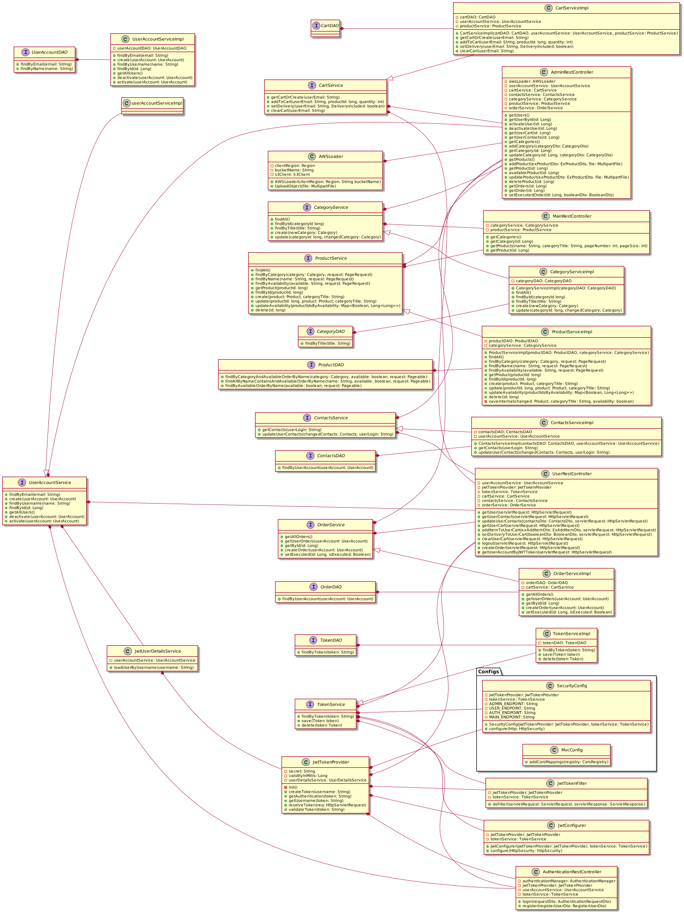
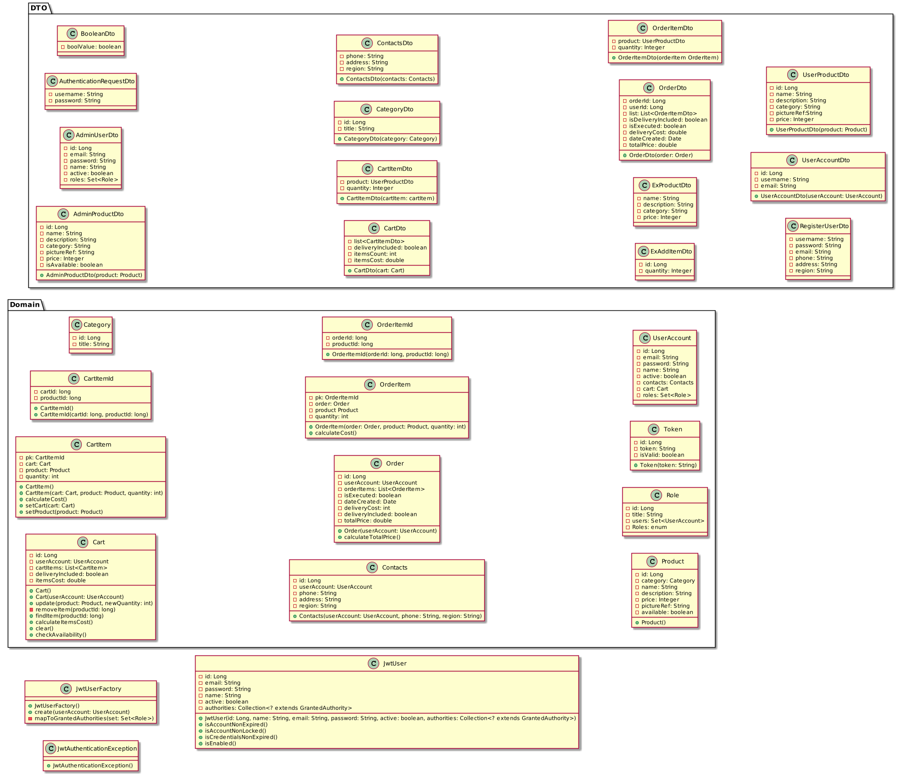

### 1. Application use case
The **Use Cases Diagram** is the following diagram:

### 2. Activity Diagrams
#### 2.1. Add Item to cart

#### 2.2. Login

#### 2.3. Search

### 3. Sequences Diagrams
#### 3.1. Add Item

#### 3.2. Login

#### 3.3. Request filter

### 4. Class Diagram

### 5. State Machine Diagrams
#### 5.1. Edit Item

### 6. Component & Deployment Diagrams

